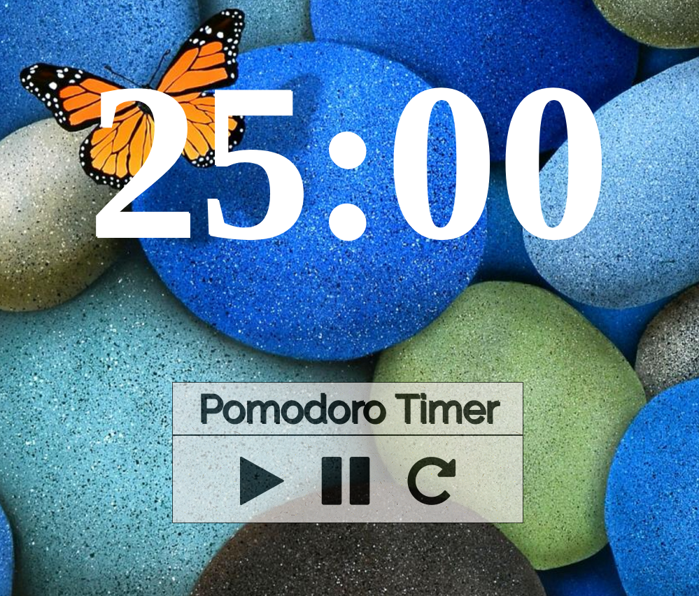

# Pomodoro Project

Check out my [Pomodoro Timer](https://jonathanyiv.github.io/pomodoro/)!

The [Pomodoro Technique](https://en.wikipedia.org/wiki/Pomodoro_Technique) is a time management method that uses a timer to break work down into intervals separated by short breaks.

This is a project from [The Odin Project](https://www.theodinproject.com/courses/web-development-101/lessons/pairing-project).

## Pre-Project Thoughts

1. I had previously skipped this project because I was waiting for a pair, but I have decided to go ahead and do it. Some of the material and syntax feels hazy to me, but I strongly remember the concepts. I will probably rely on reference material before I become fully confident.

2. I will do the projects in these steps:
	
	1. Create the View/Spacing

	2. Figure out the timer and button functionalities

## Post-Project Thoughts

1. For this project, I wanted to focus on making it a little prettier and having a little responsive design over just the functionality. Some of the things I considered:

	1. I learned about "icon fonts" and used [FontAwesome](http://fontawesome.io/) as my buttons. I wish I knew about this for the Google Search/Homepage projects. It is definitely really nifty and useful.

	2. I read about 'textures' and used a texture from [Subtle Patterns](https://www.toptal.com/designers/subtlepatterns/).

2. One thing I noticed was that right now I am learning Ruby, and transitioning back to HTML/CSS/Javascript/jQuery was a bit difficult as I don't believe I had developed mastery over each of the tools. HTML and CSS came back to me the easiest, but I found myself having to think harder when trying to figure out the necessary Javascript code to produce my desired result.
